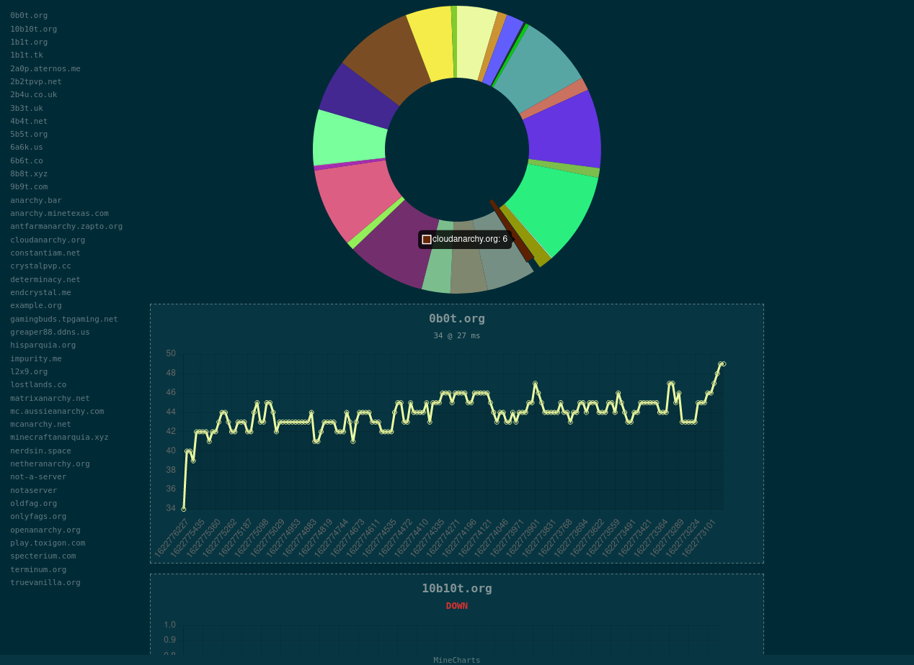

# MineCharts

placeholder

---

###### screenshot

---

###### <3

[mcstatus](https://github.com/Dinnerbone/mcstatus),
[Flask](https://flask.palletsprojects.com/),
[Flask-Limiter](https://flask-limiter.readthedocs.io/),
[gunicorn](https://gunicorn.org/),
[requests](https://docs.python-requests.org/en/master/index.html),
[Solarized Dark](https://ethanschoonover.com/solarized/)
